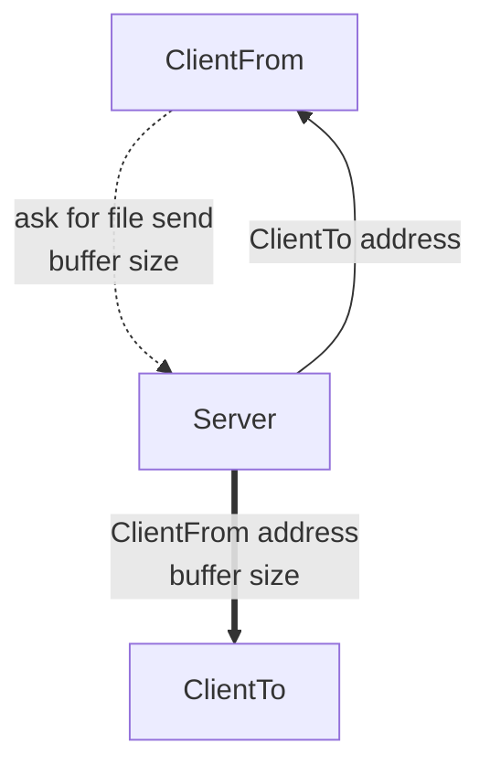
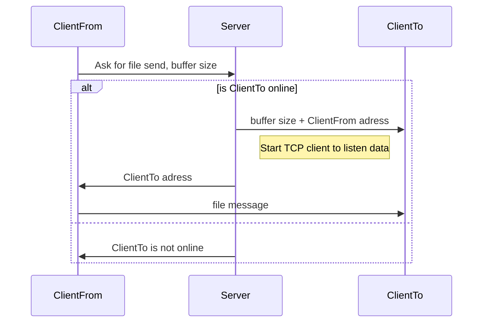

```mermaid
graph TD;
    from[ClientFrom]
    to[ClientTo]
    server[Server]
    
    from -. ask for file send<br/>buffer size .-> server
    server == ClientFrom address<br/>buffer size ==> to
    server -- ClientTo address ---> from
    
```

```mermaid
sequenceDiagram
    participant ClientFrom
    participant Server
    participant ClientTo

    ClientFrom ->> Server: Ask for file send, buffer size
    alt is ClientTo online 
        Server ->> ClientTo: buffer size + ClientFrom adress
        Note left of ClientTo: Start TCP client to listen data
        Server ->> ClientFrom: ClientTo adress 
        ClientFrom ->> ClientTo: file message
    else
        Server ->> ClientFrom: ClientTo is not online
    end
    

```