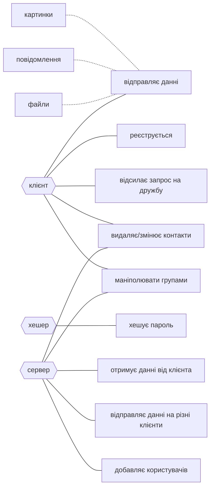

```mermaid
flowchart LR
  client{{клієнт}}
  hasher{{хешер}}
  server{{сервер}}


  rcc[видаляє/змінює контакти]
  csd[відправляє данні]
  mg[маніполювати групами]

  картинки-.-csd
  повідомлення-.-csd
  файли-.-csd

  client---csd
  client---c1[реєструється]
  client---c2[відсилає запрос на дружбу]
  client---rcc
  client---mg
 
  
  server---s1[отримує данні від клієнта]
  server---s2[відправляє данні на різні клієнти]
  server---sau[добавляє користувачів]
  server---mg
  server---rcc


  hasher---hp[хешує пароль]  

```