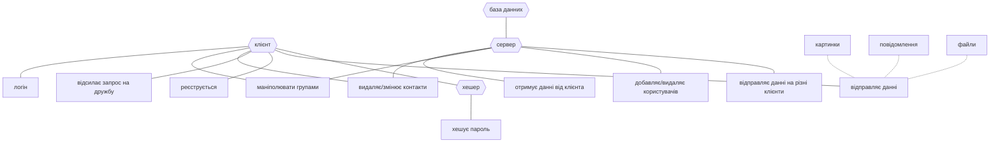

```mermaid
flowchart TD
  client{{клієнт}}
  hasher{{хешер}}
  server{{сервер}}
  bd{{база данних}}


  rcc[видаляє/змінює контакти]
  csd[відправляє данні]
  mg[маніполювати групами]

  картинки-.-csd
  повідомлення-.-csd
  файли-.-csd

  hasher---hp[хешує пароль]
  client---hasher

  client---csd
  client---c1[реєструється]
  client---c2[відсилає запрос на дружбу]
  client---rcc
  client---mg
  client---c4[логін]
 
  server---s2[відправляє данні на різні клієнти]
  server---sau[добавляє/видаляє користувачів]
  server---mg
  server---rcc
  server---s1[отримує данні від клієнта]

  bd---server

```
